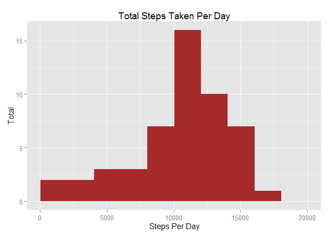
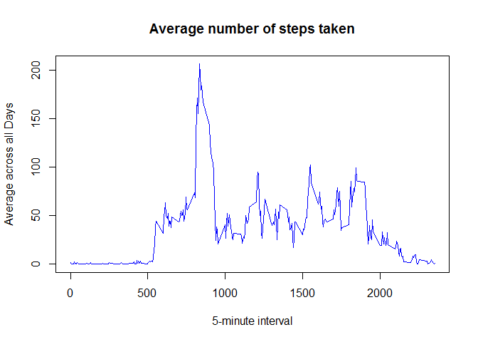

# Reproducible Research: Peer Assessment 1

## Loading and preprocessing the data


```r
library(data.table)
library(dplyr)
library(ggplot2)
library(lattice)

unzip("activity.zip")
dt <- data.table(read.csv("activity.csv"))
dt$date <- as.Date(dt$date, "%Y-%m-%d")
```

## What is mean total number of steps taken per day?


```r
dt %>% select(date, steps) %>%
    group_by(date) %>%
    summarise(nsteps = sum(steps, na.rm=FALSE)) %>%
    filter(!is.na(nsteps)) -> steps

rng = range(steps$nsteps)
ggplot(data=steps, aes(steps$nsteps)) +
    geom_histogram(breaks=seq(rng[1], rng[2], by=2000), fill="Brown") +
    xlab("Steps Per Day") +
    ylab("Total") +
    ggtitle("Total Steps Taken Per Day")
```

 

```r
mean(steps$nsteps)
```

```
## [1] 10766.19
```

```r
median(steps$nsteps)
```

```
## [1] 10765
```

## What is the average daily activity pattern?


```r
ts <- tapply(dt$steps, dt$interval, mean, na.rm = TRUE)
plot(row.names(ts), ts, type = "l",
     xlab = "5-minute interval", ylab = "Average across all Days",
     main = "Average number of steps taken",
     col = "Blue")
```

 

```r
interval <- which.max(ts)
names(interval)
```

```
## [1] "835"
```

## Inputting missing values


```r
dt %>%
    na.omit() %>%
    group_by(date) %>%
    summarise(mean.steps = mean(steps)) -> steps.mean

dt %>% left_join(steps.mean) -> dt.filled
```

```
## Joining by: "date"
```

```r
# Drop the dates that have *NO* steps with data
dt.filled <- dt.filled[complete.cases(dt.filled$mean.steps)]
# Update records having steps = NA to mean.steps for the date
dt.filled$steps[is.na(dt.filled$steps)] <- dt.filled$mean.steps[is.na(dt.filled$steps)]
dt.filled %>% select(date, steps, interval) -> dt.filled

dt.filled %>% select(date, steps) %>%
    group_by(date) %>%
    summarise(nsteps = sum(steps, na.rm=FALSE)) %>%
    filter(!is.na(nsteps)) -> steps

rng = range(steps$nsteps)
ggplot(data=steps, aes(steps$nsteps)) +
    geom_histogram(breaks=seq(rng[1], rng[2], by=2000), fill="Brown") +
    xlab("Steps Per Day") +
    ylab("Total") +
    ggtitle("Total Steps Taken Per Day")
```

 

```r
mean(steps$nsteps)
```

```
## [1] 10766.19
```

```r
median(steps$nsteps)
```

```
## [1] 10765
```


## Are there differences in activity patterns between weekdays and weekends?


```r
dt.filled %>% mutate(dow = weekdays(date)) %>%
    mutate(dow = ifelse((dow %in% c("Sunday","Saturday")), "weekend", "weekday")) %>%
    select(steps, date, interval, dow) -> dt.days

dt.days$dow <- as.factor(dt.days$dow)

dt.steps <- aggregate(dt.days$steps, by = list(dt.days$interval, dt.days$dow), mean)
names(dt.steps) <- c("interval", "dow_type", "steps")

xyplot(steps ~ interval | dow_type, dt.steps, type = "l", layout = c(1, 2),
       xlab = "Interval", ylab = "Number of steps")
```

 

